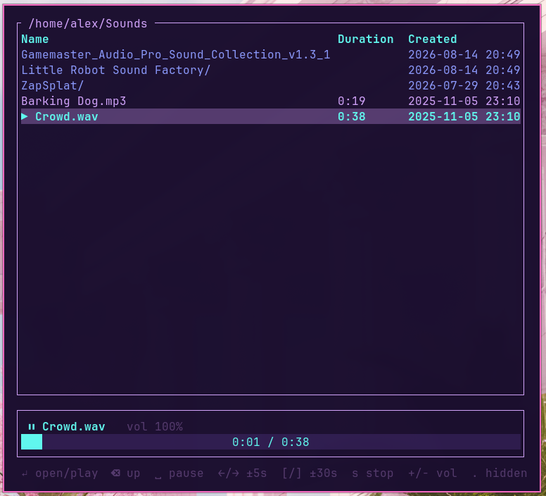

# sound-explorer

A terminal file browser for audio. Point it at a folder and it lists sound files with duration and created date, and plays them with seek controls.



## Usage

```
cargo run --release            # browse the current directory
cargo run --release -- ~/Music # browse a specific directory
```

Or install it: `cargo install --path .` then `sound-explorer [dir]`.

## Keys

| Key | Action |
| --- | --- |
| `↑`/`↓` or `j`/`k` | move selection |
| `Enter` or `l` | open directory / play file |
| `Backspace` or `h` | go to parent directory |
| `Space` | pause / resume |
| `←`/`→` | seek -5s / +5s |
| `[`/`]` or `Shift+←`/`Shift+→` | seek -30s / +30s |
| `s` | stop playback |
| `+`/`-` | volume up / down |
| `.` | toggle hidden files |
| `r` | refresh listing |
| `g`/`G`, `Home`/`End`, `PgUp`/`PgDn` | jump around the list |
| `q` or `Esc` | quit |

When a track finishes, the next audio file in the listing plays automatically.

## Notes

- Recognized extensions: mp3, wav, flac, ogg/oga, m4a, aac, mp4, opus, aiff, wma. Decoding uses symphonia via rodio, so a few of those (opus, wma) will list but may fail to play.
- Durations load in a background thread; entries show `…` until probed.
- "Created" falls back to the file's modified time on filesystems without birth time.
